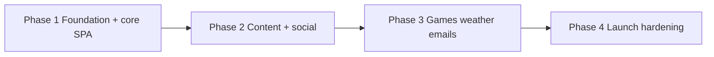

# BuddyNagar — phasewise build log

This document explains **what was installed and built per PRD phase**, **why**, **how it supports later phases**, and **dependencies on earlier work**. It is the living map of how the codebase tracks the PRD.

**Maintenance:** Whenever a new PRD phase is implemented in this repo, **append or revise the matching section here** (and add a short “Phase N complete” summary) so this file stays accurate—without waiting for a separate request.

---

## Dependency overview (high level)

| Phase | Depends on | Unlocks |
| --- | --- | --- |
| **1** | Supabase project, env vars | Auth, profiles, all sections that need “who is logged in” |
| **2** | Phase 1 schema + RLS + `profiles.roles[]` | Rich media (storage), voting, likes RPCs; Phase 3 can reuse same patterns |
| **3** | Phases 1–2 (API + auth + optional cache tables) | External APIs, cron, Resend wiring |
| **4** | Phases 1–3 deployed feature set | Production safety, ops, not new product scope |

---

## Phase 1 — Registration, profiles, spotlight, fun facts, news

Aligned with PRD: *Registration, Profiles, Spotlight, Fun Facts, News*.

### NPM / runtime dependencies added (why)

| Package | Why installed | Needed later? |
| --- | --- | --- |
| `next`, `react`, `react-dom` | App shell, App Router, RSC/client components | All phases |
| `typescript` (strict) | Type safety across API and UI | All phases |
| `tailwindcss` v4 + `@tailwindcss/postcss` | Styling per project rules | All phases |
| `@supabase/supabase-js`, `@supabase/ssr` | Auth, Postgres, Realtime, Storage client patterns | Phases 2–3 (Storage heavily in 2) |
| `clsx`, `tailwind-merge`, `class-variance-authority` | shadcn-style `cn()` and variants | All UI phases |
| `lucide-react` | Icons | All phases |
| `date-fns` | Spotlight / dates | Phase 3 cron/email may reuse |
| `zod` | Request body validation in route handlers | Phases 2–3 APIs |
| `@radix-ui/react-*` (dialog, label, slot, separator, dropdown-menu) | Accessible primitives for custom UI components | Extended in Phase 2 with `tabs` |

### What was developed (artifacts)

- **Database (`001_phase1_schema.sql`):** `profiles`, `master_friends`, `wishes`, `fun_facts`, `news_articles_cache`, stub tables for later phases, RLS, `complete_registration` RPC, Realtime on `profiles`.
- **Auth flow:** Magic link via `signInWithOtp`, `/auth/callback` route, middleware session refresh.
- **API routes:** `/api/news` (NewsAPI + cache), `/api/profile/complete`, `/api/fun-facts/[id]/react`.
- **UI sections (SPA order):** Hero + registration, Our gang, Spotlight, Fun fact, News; shared nav, scroll progress, design tokens in `globals.css`.
- **Cross-cutting:** `logger`, shared types, Supabase server/browser clients, `.env.example`.
- **Browser Supabase client:** `src/lib/supabase/client.ts` uses a **singleton** `createBrowserClient` per tab so multiple client sections do not spawn competing GoTrue storage locks (see `docs/issue-fix-log.md` for the lock warning fix).

### Why each area matters for the product

- **Profiles + `master_friends` + RPC:** Invite-only buddy wall without exposing unsafe direct updates to `master_friends` from the client.
- **News cache table:** Rate limits and offline-ish behavior; same “server route + optional service role” pattern Phase 3 can reuse for cricket/weather caches.
- **RLS baseline:** Every later phase extends policies; Phase 1 establishes public read where safe and authenticated writes where required.

### What Phase 1 does *not* include (by design)

- Cinema/poetry/gallery/suggestions behavior (Phase 2).
- Games, weather, outbound email automation (Phase 3).
- Production hardening checklist (Phase 4).

---

## Phase 2 — Cinema, poetry, gallery, suggestions

Aligned with PRD: *Cinema, Poetry, Gallery, Suggestions*.

### NPM / runtime dependencies added (why)

| Package | Why installed | Needed later? |
| --- | --- | --- |
| `@radix-ui/react-tabs` | Optional filter UI pattern (tabs primitive available; cinema/poetry use button filters for simplicity) | Reusable in Phase 3 for games/settings if desired |

### What was developed (artifacts)

- **Database (`002_phase2_schema.sql`):** Column extensions on `cinema_news`, `poetry_wall`, `photo_gallery`; like junction tables; RPCs `like_cinema_news`, `like_poetry_post`, `like_gallery_photo`, `vote_suggestion`; RLS for reads/writes; **Storage** buckets `buddynagar-cinema`, `buddynagar-poetry`, `buddynagar-gallery` + policies; Realtime publication for `cinema_news`, `poetry_wall`, `suggestions`.
- **API routes:** `POST /api/suggestions`, `POST /api/suggestions/[id]/vote`, `POST /api/cinema/[id]/like`, `POST /api/poetry/[id]/like`, `POST /api/gallery/[id]/like` (thin wrappers around RPCs + session).
- **UI sections:** `#cinema`, `#poetry`, `#memories`, `#suggest`; post dialogs with **direct Storage upload** then row insert; lightbox dialogs; nav links.
- **App logic:** `lib/permissions.ts` (`admin`, `cinema_poster`; poetry post UI is allowed for any authenticated user), `lib/embeddings.ts` (normalize PostgREST `profiles` embed), `lib/storagePaths.ts`, `Button` **secondary** variant, `textarea` UI primitive.
- **PostgREST embed hints:** Junction like tables add multiple graph paths to `profiles`. Server and client selects use `profiles!posted_by`, `profiles!uploaded_by`, and `profiles!user_id` instead of bare `profiles(...)` so inserts and lists avoid “more than one relationship” errors.
- **Gallery admin + Resend + private pending:** `003_gallery_admin_rls.sql` lets `admin` list/approve. `004_gallery_pending_private_storage.sql` adds private bucket `buddynagar-gallery-pending`, nullable `image_url`, `pending_storage_path`, drops client `INSERT` on `photo_gallery`. `POST /api/gallery/submit` (service role) stores the file privately, inserts the row, emails `GALLERY_NOTIFY_EMAIL` via Resend; `POST /api/gallery/[id]/approve` promotes the object to the public gallery. Cinema/poetry stay publish-without-approval.
- **100-hour content rotation:** `lib/contentTtl.ts` + home `page.tsx` filters hide cinema/poetry/gallery rows older than 100 hours. `GET|POST /api/cron/purge-expired-posts` (Bearer `CRON_SECRET`) deletes expired rows and Storage objects; `vercel.json` runs it hourly on Vercel.
- **Delete protection (`008_content_delete_admin_only.sql`):** Only `profiles.roles` containing `admin` may `DELETE` from `cinema_news`, `poetry_wall`, and `photo_gallery` as an authenticated client; other members cannot remove others’ (or any) posts that way. Service role still bypasses RLS for cron/API.

### Why each area matters

- **Roles on `profiles`:** Phase 1 created `roles[]`; Phase 2 enforces *who may post* cinema (admin / `cinema_poster`). Poetry posting is open to any signed-in user in the app; DB RLS still limits inserts to `posted_by = auth.uid()`.
- **RPCs for likes/votes:** Keeps counts consistent and prevents duplicate votes/likes without exposing junction tables to arbitrary client writes.
- **Gallery `is_approved`:** PRD approval flow; admin UI deferred—SQL approval documented in README until Phase 4/admin work.
- **Storage path rule `{userId}/...`:** Matches RLS policies; same pattern any Phase 3 asset upload could follow.

### Dependencies on Phase 1

- **Must exist:** `profiles`, auth session, middleware, logger, route-handler pattern, Next `Image` + Supabase remote patterns, SPA section composition in `page.tsx`.
- **Assumes:** Phase 1 migration applied before Phase 2 migration.

### How Phase 2 sets up Phase 3

- **Cron / cache:** News already uses TTL + optional service role; weather/cricket endpoints can mirror `/api/news`.
- **Email:** `email_logs` table exists from Phase 1 stub; Resend + Edge/cron (Phase 3) will write logs and send mail.
- **Games:** No new tables required for basic WhoFits link + Lichess embed; optional `chess_solves` can be added in Phase 3 migration if not already present from Phase 1 stubs.

---

## Phase 3 — Games, weather, emails (planned / not fully implemented here)

PRD scope: *Games, Weather, Emails* (plus Vercel Cron per PRD §7).

### Expected additions (when implemented)

| Area | Likely install / build | Depends on |
| --- | --- | --- |
| **Games** | Env `NEXT_PUBLIC_WHOFITS_URL`; iframe + optional Lichess fetch route; optional `chess_solves` + leaderboard RPC/RLS | Phase 1 auth for “I solved it” |
| **Weather** | `GET /api/weather`, `OPENWEATHER_API_KEY` | Server routes + env pattern from Phase 1 |
| **Cricket** | `GET /api/cricket`, `CRIC_API_KEY`, aggressive caching | Same as weather |
| **Emails** | Resend SDK, `RESEND_API_KEY`, templates, cron hitting route or Edge Function | `profiles` emails, Phase 1 `email_logs` |

### Why Phase 3 comes after 1–2

- Needs **stable identity** (Phase 1) and **content surface** (Phase 2) so emails and “weekly digest” have meaningful context.
- Cron jobs should not be wired seriously until **production** concerns (Phase 4) are near.

*When Phase 3 is implemented, extend this section with actual packages, files, and migrations.*

---

## Phase 4 — Launch & hardening (planned)

PRD scope: *Vercel deploy, secrets, auth URLs, RLS review, cron, observability, a11y/perf, domain, backups*.

### Expected work (when executed)

- Vercel project + env parity with `.env.example` / Supabase dashboard.
- Supabase **redirect URL** allowlist for production.
- **RLS audit** (especially Storage + RPC grants).
- **Vercel Cron** schedules aligned with PRD (news refresh, birthday, weekly bulletin—exact routes TBD with Phase 3 email design).
- Smoke tests: magic link, uploads, votes, mobile nav.

*When Phase 4 is executed, append a dated checklist outcome here.*

---

## Quick file index by phase

| Concern | Phase 1 touchpoints | Phase 2 touchpoints |
| --- | --- | --- |
| Migrations | `001_phase1_schema.sql` | `002_phase2_schema.sql` |
| Seed | `phase1_seed.sql` | (optional future `phase2_seed.sql`) |
| Home layout | `src/app/page.tsx` (sections 1–5) | Same file (sections 6–9) |
| APIs | `api/news`, `api/profile/complete`, `api/fun-facts/...` | `api/suggestions`, `api/.../like`, vote route |
| Auth | `middleware.ts`, `auth/callback`, Hero + profile form | Same session for posts/likes/votes |
| UI primitives | `button`, `card`, `dialog`, `input`, `label`, `skeleton`, `badge` | `tabs`, `textarea`, secondary `button` variant |

---

*Document version: reflects Phases 1–2 as implemented in-repo. Update this file when Phase 3+ land.*
